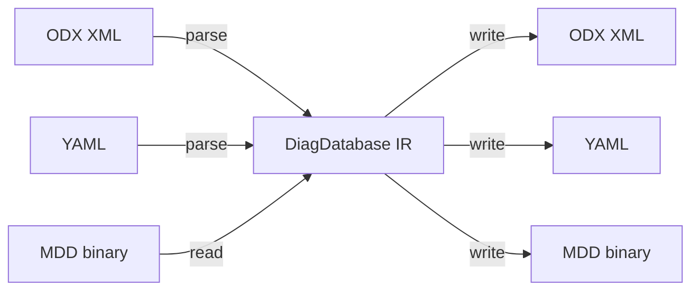

# diag-converter


Rust replacement for the `odx-converter` (Kotlin) and `yaml-to-mdd` (Python) diagnostic toolchains. Converts between automotive diagnostic formats through a canonical intermediate representation (IR), enabling any-to-any format conversion with a single tool.

## Supported formats

| Format | Extension | Read | Write | Description |
|--------|-----------|------|-------|-------------|
| ODX | `.odx`, `.pdx` | Yes | Yes | ISO 22901-1 XML diagnostic data |
| YAML | `.yml`, `.yaml` | Yes | Yes | Human-readable diagnostic descriptions |
| MDD | `.mdd` | Yes | Yes | Binary format (Protobuf + FlatBuffers) |

## Architecture

All conversions go through a canonical intermediate representation (`DiagDatabase`), so adding a new format requires only one parser and one writer - not N converters.



## Installation

```bash
cargo install --path diag-cli
```

## Usage

### Convert between formats

```bash
# YAML to MDD
diag-converter convert input.yml -o output.mdd

# ODX to MDD with LZMA compression (default)
diag-converter convert input.odx -o output.mdd --compression lzma

# MDD to YAML
diag-converter convert input.mdd -o output.yml

# MDD to ODX
diag-converter convert input.mdd -o output.odx

# PDX archive (zipped ODX) to MDD
diag-converter convert input.pdx -o output.mdd

# Batch conversion (multiple inputs to a directory)
diag-converter convert *.yml -O output_dir/ --format mdd

# Lenient ODX parsing (warn instead of fail on malformed references)
diag-converter convert input.odx -o output.mdd -L

# Include job files (JARs) in MDD output
diag-converter convert input.yml -o output.mdd --include-job-files ./jars/

# Filter by audience
diag-converter convert input.odx -o output.mdd --audience aftermarket

# Dry run (parse and validate without writing)
diag-converter convert input.yml -o output.mdd --dry-run

# Write conversion log alongside output
diag-converter convert input.yml -o output.mdd --log-level debug
```

### Validate a diagnostic file

```bash
diag-converter validate input.yml
diag-converter validate input.odx --summary
```

### Display file information

```bash
diag-converter info input.mdd
```

## Crate structure

| Crate | Description |
|-------|-------------|
| `mdd-format` | MDD binary reader/writer - Protobuf container with compressed FlatBuffers payload |
| `diag-ir` | Canonical IR types (`DiagDatabase`) and FlatBuffers serialization |
| `diag-yaml` | YAML parser/writer with JSON Schema validation |
| `diag-odx` | ODX/PDX parser/writer (ISO 22901-1 XML) |
| `diag-cli` | CLI entry point with convert/validate/info subcommands |

## Building

### Cargo

```bash
cargo build --workspace
cargo test --workspace
```

### Bazel

```bash
bazel build //...
bazel test //...
```

## Documentation

- [Architecture overview](docs/architecture/overview.md)
- [MDD format specification](docs/architecture/mdd-format.md)
- [Design decisions](docs/architecture/design-decisions.md)
- [Adding new formats](docs/architecture/extending.md)
- [YAML schema reference](docs/yaml-schema/SCHEMA.md)

## License

[Apache-2.0](LICENSE)
