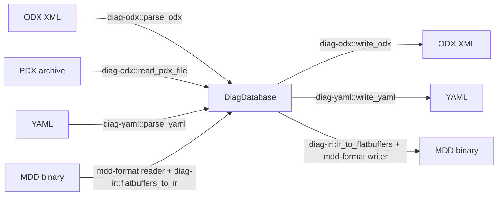
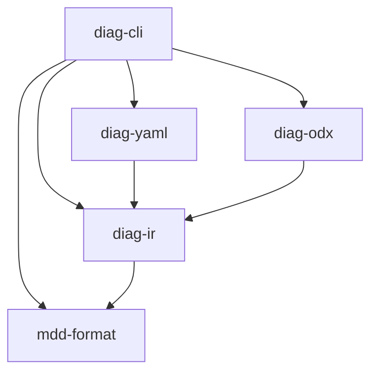

# Architecture Overview

## Introduction

diag-converter is a Rust tool that replaces two legacy toolchains:
- `odx-converter` (Kotlin) - converted ODX XML to MDD binary
- `yaml-to-mdd` (Python) - converted YAML to MDD binary

Both were format-pair converters: each knew how to read one format and write another. Adding a new format meant writing N new converters. diag-converter uses an IR-centric architecture that decouples parsing from writing, reducing the problem from N^2 converters to N parsers + N writers.

## IR-centric architecture

All format conversions go through a canonical intermediate representation - the `DiagDatabase` type defined in `diag-ir`. This means:

- Adding a new format requires only one parser and one writer
- All formats share the same validation logic
- Round-trip testing (format A -> IR -> format B -> IR -> compare) is straightforward



## Crate dependency graph



| Crate | Responsibility |
|-------|---------------|
| `mdd-format` | Low-level MDD binary I/O - Protobuf envelope, FlatBuffers payload, compression, signatures |
| `diag-ir` | Canonical IR types (`DiagDatabase`) and FlatBuffers serialization (`ir_to_flatbuffers`, `flatbuffers_to_ir`) |
| `diag-yaml` | YAML parsing/writing with JSON Schema validation |
| `diag-odx` | ODX XML and PDX archive parsing/writing |
| `diag-cli` | CLI entry point - format detection, batch conversion, validation, info display |

## IR schema overview

The `DiagDatabase` is the root type. Key relationships:

```
DiagDatabase
  +-- ecu_name, version, revision, metadata
  +-- variants: Vec<Variant>
  |     +-- diag_layer: DiagLayer
  |     |     +-- diag_services: Vec<DiagService>
  |     |     +-- single_ecu_jobs: Vec<SingleEcuJob>
  |     |     +-- com_param_refs, state_charts, audiences
  |     +-- variant_patterns: Vec<VariantPattern>
  |     +-- parent_refs: Vec<ParentRef>  (inheritance)
  +-- functional_groups: Vec<FunctionalGroup>
  +-- dtcs: Vec<Dtc>
  +-- memory: Option<MemoryConfig>
```

### Key types

- **`DiagDatabase`** - root container mapping to FBS `EcuData`. Holds all variants, DTCs, and metadata.
- **`Variant`** - a specific ECU configuration. Contains a `DiagLayer` with services and jobs. Inheritance is modeled via `ParentRef`.
- **`DiagLayer`** - the service container within a variant. Holds diagnostic services, single ECU jobs, state charts, COM parameters, and audience definitions.
- **`DiagService`** - a diagnostic operation with request parameters and positive/negative response definitions. Parameters reference DOPs (Data Object Properties) for encoding.
- **`Dtc`** - Diagnostic Trouble Code with ID, severity, and text descriptions.
- **`VariantPattern`** - rules for identifying which physical ECU matches this variant (matching parameters and expected values).

## Format-specific notes

### ODX (ISO 22901-1)

XML format with `DIAG-LAYER-CONTAINER` as the root element. Key concepts:
- Hierarchical layers (protocol -> functional group -> base variant -> ECU variant) with inheritance via `PARENT-REF`
- `DIAG-COMM` elements define diagnostic services with request/response structures
- References between elements use `SHORT-NAME` lookups
- PDX files are ZIP archives containing one or more ODX files

### YAML

Human-readable diagnostic descriptions validated against a JSON Schema (`docs/yaml-schema/schema.json`). Features:
- Flat structure - no inheritance, all services fully expanded per variant
- Service generation from templates (`diag-yaml` can generate service sets from patterns)
- Semantic validation catches issues beyond schema compliance (duplicate names, invalid references)

### MDD (binary)

Compact binary format with a Protobuf envelope containing compressed FlatBuffers payload. See [MDD format specification](mdd-format.md) for the full wire format. Key properties:
- Magic bytes for format identification
- Chunks: main diagnostic data (FlatBuffers) plus optional embedded files (JARs)
- Compression: LZMA (default, CDA compatible), Gzip, Zstd, or None
- SHA-512 signatures for integrity verification
- Uses a custom FlatBuffers fork (`alexmohr/flatbuffers`) for CDA binary compatibility
